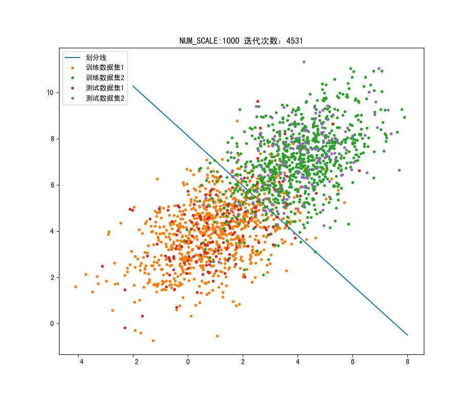

<br>
<br>
<br>
<br>
<br>
<br>
<center><h3>哈尔滨工业大学计算机科学与技术学院</h3></center>
<center><h2>实验报告</h2></center>
<br>
<br>
<br>
<br>
<br>
<br>
<center><h4>课程名称：机器学习</h4></center>
<center><h4>课程类型：选修</h4></center>
<center><h4>实验题目：逻辑回归</h4></center>
<br>
<br>
<br>
<center><p>学号：7203610316</p></center>
<center><p>姓名：符兴</p></center>
<div STYLE="page-break-after: always;"></div>

## 1.实验目的

&emsp;&emsp;理解逻辑回归模型，掌握逻辑回归模型的参数估计算法。

## 2.实验要求及实验环境

### 2-1.实验要求

&emsp;&emsp;实现两种损失函数的参数估计（1，无惩罚项；2.加入对参数的惩罚），可以采用梯度下降、共轭梯度或者牛顿法等。
&emsp;&emsp;验证：可以手工生成两个分别类别数据（可以用高斯分布），验证你的算法。考察类条件分布不满足朴素贝叶斯假设，会得到什么样的结果。逻辑回归有广泛的用处，例如广告预测。可以到UCI网站上，找一实际数据加以测试。

### 2-2.实验环境

&emsp;&emsp;Ubuntu+VSCode+Python3.9

## 3.设计思想（本程序中的用到的主要算法及数据结构）

### 3-1.生成训练数据

&emsp;&emsp;在本次实验中，使用`np.random.multivariate_normal()`生成二维高斯分布。
&emsp;&emsp;其中数据1的数据参数为$\mu = [0,4] , \sigma = \begin{bmatrix}
    2,0\\
    0,2
\end{bmatrix}$，数据2的数据参数为$\mu = [4,8] , \sigma = \begin{bmatrix}
    2,0\\
    0,2
\end{bmatrix}$。

### 3-2.梯度下降法

&emsp;&emsp;在本次实验中，考虑的是二分布问题。同时满足下面两种假设：
&emsp;&emsp;(1) 类别先验服从伯努利分布
&emsp;&emsp;(2) 类内样本点服从正态分布，同时正例和反例的正态分布具有相同的协方差矩阵。
&emsp;&emsp;因此，由贝叶斯公式可得在给定样本的情况下，其为正例的概率为：
$$
\begin{align}
    P(Y=1|X=x)&=\frac{P(X=x|Y=1)P(Y=1)}{P(X=x)} \\
              &=\frac{P(X=x|Y=1)P(Y=1)}{P(X=x|Y=1)P(Y=1)+P(X=x|Y=0)P(Y=0)} 
\end{align} \tag{1}
$$

即：

$$
\begin{align}
    P(Y=1|X=x)&=\frac{1}{1+\frac{\exp\{-\frac{1}{2}(x-\mu_0)^T\sum^{-1}(x-\mu_0)\}}{\exp\{-\frac{1}{2}(x-\mu_1)^T\sum^{-1}(x-\mu_1)\}} \cdot \frac{1-p}{p}} \\
              &=\frac{1}{1+\exp\{(\mu_0-\mu_1)^T\sum^{-1}x+\frac{1}{2}(\mu_1^T\sum^{-1}\mu_1-\mu_0^T\sum^{-1}\mu_0)+\ln(\frac{1-p}{p})\}} 
\end{align} \tag{2}
$$

此时，不妨令$w=\sum^T(\mu_0-\mu_1)=(w_0,w_1,...,w_d)$，$b=\frac{1}{2}(\mu_1^T\sum^{-1}\mu_1-\mu_0^T\sum^{-1}\mu_0)$，则式(2)可简化得：

$$
P(Y=1|X=x)=\frac{1}{1+\exp\{w^Tx+b\}} \tag{3}
$$

&emsp;&emsp;由式(3)我们即可通过函数来计算概率并进行判断。在逻辑回归中，某个样本属于其真实标记样本的概率越大越好；不妨令式(3)为$f(x)=\frac{1}{1+\exp\{x\}}$由最大似然函数可知：

$$
\begin{align}
    L(w)&=P(y|x;w)=\argmax \prod^n_{i=1}P(y^{(i)}|x^{(i)};w)\\&=\argmax \prod^n_{i=1}f(x^{(i)})^{y^{(i)}}(1-f(x^{(i)}))^{1-y^{(i)}}
\end{align} \tag{4}
$$

对式(4)取对数有：

$$
\begin{align}
    L^{'}(w)&=\argmax \ln{L(w)}\\
    &=\argmax \sum^n_{i=1}(y^{(i)}\ln{f(x^{(i)})}+(1-y^{(i)}\ln{(1-f(x^{(i)}))}))\\
    &=\argmin \sum^n_{i=1}[-y_i(w^T+b)+\ln{(1+\exp\{w^Tx+b\})}]
\end{align} \tag{5}
$$

式(5)对$w$求偏导可得：

$$
\frac{\partial{L^{'}}}{\partial{w}} = -\sum^N_{i=1}x_i(y_i-\frac{\exp\{w^Tx\}}{1+\exp\{w^Tx\}}) \tag{6}
$$

&emsp;&emsp;综上推导，目标是最小化关于$w$、$b$的损失函数。在本次实验中，我们令数据为：$Data = [1,x_1,x_2]$，因此$w = [w_0,w_1,w_2]T$，这样就不需要对参数$b$单独处理。即梯度下降的迭代式子为:

$$
w^{i} = w^{i-1} - lr*\frac{\partial{L^{'}}}{\partial{w}} \tag{7}
$$

### 3-3.添加正则项
&emsp;&emsp;在训练过程中，可以加入正则项$w$来约束其模长，即损失函数改为：

$$
L^{'}(w)=\sum^n_{i=1}[-y_i(w^Tx+b)+\ln{(1+\exp\{w^Tx+b\})}] + \frac{\lambda}{2}w^Tw \tag{8}
$$

即式(8)对$w$求偏导可得：
_$$
\frac{\partial{L^{'}}}{\partial{w}} = -\sum^N_{i=1}x_i(y_i-\frac{\exp\{w^Tx\}}{1+\exp\{w^Tx\}})+\lambda w \tag{9}
$$


## 4.实验结果分析

### 4-1.满足朴素贝叶斯不带正则项的实验结果

<table>
<caption align="top">表1 满足朴素贝叶斯不带正则项的实验数据</caption>
<tr>
<td>

<div style="text-align:center">正确率:0.98</div>
</td>
</tr>
</table>

### 4-2.满足朴素贝叶斯带正则项的实验结果

<table>
<caption align="top">表2 满足朴素贝叶斯带正则项的实验数据</caption>
<tr>
<td>

<div style="text-align:center">正则项系数:1e-6</div>
<div style="text-align:center">正确率:0.97</div>
</td>
</tr>
</table>

### 4-3.不满足朴素贝叶斯不带正则项的实验结果

&emsp;&emsp;不满足朴素贝叶斯即几个样本维度之间并不满足相互独立的条件，在本次实验中表现为数据参数为$\mu = [4,8] , \sigma = \begin{bmatrix}
    2,1\\
    1,2
\end{bmatrix}$。即两个维度的协方差不为0，二者之间不是相互独立的。

<table>
<caption align="top">表3 不满足朴素贝叶斯不带正则项的实验数据</caption>
<tr>
<td>

<div style="text-align:center">正确率:0.88</div>
</td>
</tr>
</table>

### 4-4.不满足朴素贝叶斯带正则项的实验结果

<table>
<caption align="top">表4 不满足朴素贝叶斯带正则项的实验数据</caption>
<tr>
<td>

<div style="text-align:center">正则项系数:1e-6</div>
<div style="text-align:center">正确率:0.893</div>
</td>
</tr>
</table>

<table>
<caption align="top">表5 不满足朴素贝叶斯带正则项的实验数据 cov=3</caption>
<tr>
<td>

<div style="text-align:center">正则项系数:1e-6</div>
<div style="text-align:center">正确率:0.82</div>
</td>
</tr>
</table>

## 5.结论
&emsp;&emsp;1.在满足朴素贝叶斯条件下，逻辑回归的正确率高达0.97，分类效果较好。
&emsp;&emsp;2.在本次实验中，正则项系数的作用没有实验1的明显，对正确率影响不大。
&emsp;&emsp;3.在不满足朴素贝叶斯条件下，逻辑回归的正确率不高，原因是样本维度之间存在相关性。
&emsp;&emsp;4.在不满足朴素贝叶斯条件下，协方差越大，正确率越低，分类效果越不好。

## 6.参考文献

&emsp;&emsp;[1]阿泽. 【机器学习】逻辑回归（非常详细）. 知乎专栏. https://zhuanlan.zhihu.com/p/74874291?ivk_sa=1024320u
&emsp;&emsp;[2]程序遇上只能星空. 详解优化算法之梯度下降法. CSDN专栏. https://blog.csdn.net/kevinjin2011/article/details/125299113

## 7.代码附录

```python
# %%
import numpy as np
import matplotlib.pyplot as plt

class GradientDescentOptimizer:
    def __init__(self,numScale,learningRate,lossLimit):
        self.numScale=numScale
        self.learningRate=learningRate
        self.lossLimit=lossLimit

    def sigmoid(self,xMatrix,wVec):
        return 1 / (1 + np.exp(-np.dot(xMatrix, wVec)))
    
    def calcGradient(self,xMatrix,wVec,tVec,lambdaPenalty):
        return xMatrix.T.dot(tVec-self.sigmoid(xMatrix,wVec))+ lambdaPenalty * wVec
    
    def calcLoss(self,xMatrix,wVec,tVec,lambdaPenalty):
        return np.sum(-np.dot(tVec.T, np.log(self.sigmoid(xMatrix, wVec)))-np.dot((np.ones((len(tVec), 1)) - tVec).T,np.log(np.ones((len(tVec), 1)) - self.sigmoid(xMatrix, wVec)),))/len(xMatrix) + 0.5*lambdaPenalty*np.dot(wVec.T,wVec)
    
    def optimizeParam(self,xMatrix,wVec,tVec,lambdaPenalty):
        # 观测优化过程以及优化次数的限制
        ck=0
        # 记录Loss值
        lastLoss=self.calcLoss(xMatrix,wVec,tVec,lambdaPenalty)
        loss=lastLoss
        while True:
            wVecTmp=wVec+self.learningRate*self.calcGradient(xMatrix,wVec,tVec,lambdaPenalty)
            lossTmp=self.calcLoss(xMatrix,wVecTmp,tVec,lambdaPenalty)
            if lossTmp>lastLoss:
                self.learningRate*=0.5
            else:
                wVec=wVecTmp
                loss=lossTmp
                if(np.abs(loss-lastLoss)<self.lossLimit) and (loss<=1.3 or wVec.shape[0]<=3):
                    break
                lastLoss=loss
            ck+=1
        return wVec,ck
# 生成数据
def makeData(numScale,mean,sigma):
    data = np.random.permutation(np.random.multivariate_normal(mean,sigma,numScale))
    data = np.hstack((np.array([1 for _ in range(0,len(data))]).reshape(len(data),1),data))
    # Shuffle数据，并划分数据集和测试集
    train= data[0:int(0.85*numScale),]
    test= data[len(train):len(data),]
    return train,test

# 画出划分线线
def drawLine(wVec):
    x = np.linspace(-2, 8, 100)
    y = (-wVec[0][0] - wVec[1][0] * x) / wVec[2][0]
    plt.plot(x,y,label="划分线")

# 计算正确率
def judge(wVec,test1,test2):
    result1 = test1.dot(wVec)
    result2 = test2.dot(wVec)
    errCnt = 0
    for i in result1:
        if i > 0:
            errCnt += 1
    for i in result2:
        if i < 0:
            errCnt += 1
    return (len(test1)+len(test2)-errCnt)/(len(test1)+len(test2))

# %%
# 超参
NUM_SCALE = 1000
LEARNING_RATE = 0.01
LOSS_LIMIT = 1e-8

# 生成数据
train1,test1 = makeData(NUM_SCALE,np.array([1,4]),np.array([[2, 3], [3, 2]]))
train2,test2 = makeData(NUM_SCALE,np.array([4,7]),np.array([[2, 3], [3, 2]]))

# %%
# 生成训练数据并无正则项的梯度下降
data = np.vstack((train1,train2))
label = np.vstack((np.zeros((len(train1),1)),np.ones((len(train2),1))))
optimizer=GradientDescentOptimizer(NUM_SCALE,LEARNING_RATE,LOSS_LIMIT)
wVec,cnt = optimizer.optimizeParam(data,np.ones((3,1)),label,1e-6)

# 显示结果
print("正确率："+str(judge(wVec,test1,test2)))
drawLine(wVec)
plt.title("NUM_SCALE:"+str(NUM_SCALE)+" 迭代次数："+str(cnt))
plt.plot(train1[0:,1],train1[0:,2],".",label="训练数据集1")
plt.plot(train2[0:,1],train2[0:,2],".",label="训练数据集2")
plt.plot(test1[0:,1],test1[0:,2],".",label="测试数据集1")
plt.plot(test2[0:,1],test2[0:,2],".",label="测试数据集2")
plt.legend()
plt.show()


```