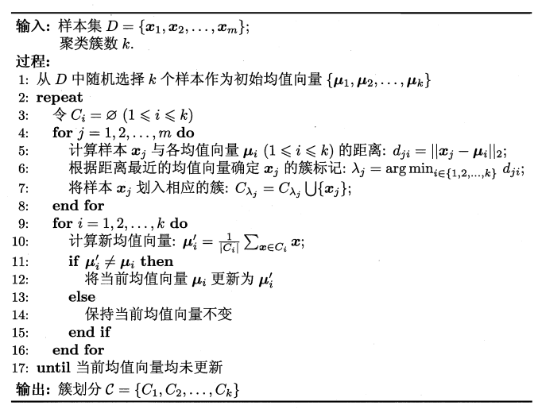
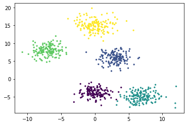
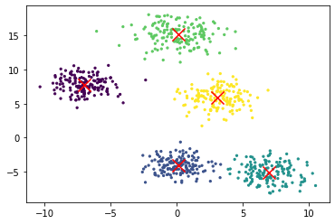
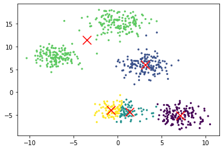
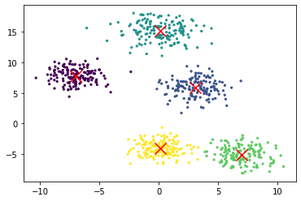
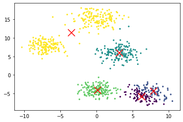
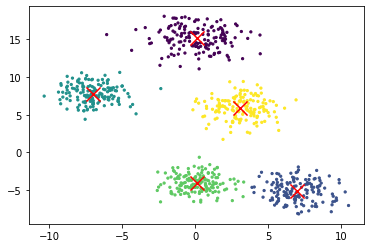

 
 
 
 
 
 

<h3>哈尔滨工业大学计算机科学与技术学院</h3>

<h2>实验报告</h2>

 
 
 
 
 
 

<h4>课程名称：机器学习</h4>

<h4>课程类型：选修</h4>

<h4>实验题目：实现k-means聚类方法</h4>

 
 
 

学号：7203610316

姓名：符兴

## 1.实验目的

&emsp;&emsp;理解K-means模型，实现一个k-means算法。

## 2.实验要求及实验环境

### 2-1.实验要求

&emsp;&emsp;1. 高斯分布产生k个高斯分布的数据（不同均值和方差）（其中参数自己设定）。
&emsp;&emsp;2. 使用k-means聚类，测试效果；

### 2-2.实验环境

&emsp;&emsp;Ubuntu+VSCode+Python3.9

## 3.设计思想（本程序中的用到的主要算法及数据结构）

### 3-1.生成训练数据
&emsp;&emsp;在本次实验中，使用`np.random.multivariate_normal()`生成二维高斯分布。同时设定簇个数为5，它们的均值和方差分别为：
&emsp;&emsp;$\mu = [0,-4] , \sigma = \begin{bmatrix}
    1.4,0\\
    0,1.4
\end{bmatrix}$

&emsp;&emsp;$\mu = [3,6] , \sigma = \begin{bmatrix}
    1.8,0\\
    0,1.8
\end{bmatrix}$

&emsp;&emsp;$\mu = [7,-5] , \sigma = \begin{bmatrix}
    2.25,0\\
    0,2.25
\end{bmatrix}$

&emsp;&emsp;$\mu = [-7,8] , \sigma = \begin{bmatrix}
    1.7,0\\
    0,1.7
\end{bmatrix}$

&emsp;&emsp;$\mu = [0,15] , \sigma = \begin{bmatrix}
    2.55,0\\
    0,2.55
\end{bmatrix}$

### 3-2.K-means
---

- 相似度计算：

    $$
    s(x,y) = \frac{\sum^p_{i=1}(x_i-\overline x)(y_i-\overline y)}{\sqrt{\sum^p_{i=1}(x_i-\overline x)^2 \times \sum^p_{i=1}(y_i-\overline y)}}
    $$

---
- 算法流程：

    

&emsp;&emsp;K-means是通过随机选择k个点作为初始的聚类中心，然后计算样本点距离哪个中心最近，然后就把这个样本点标记为这个中心代表的这个类中；全部标记结束后，就可以得到k个簇，通过求平均值的方式得到每个簇新的中心；如果新的中心相对于上一次的中心变化幅度小于设定的误差，程序则结束并输出结果；否则需要重复之前的划分过程，如此往复。

&emsp;&emsp;所以K-Means基于以下两个公式，每次最小化$E$然后重新求均值：

$$
E = \sum^k_{i=1}\sum_{x\in C_i}||x-\mu_i||^2_2
$$

$$
\mu_i = \frac{1}{|C_i|}\sum_{x\in C_i}x_i
$$

&emsp;&emsp;在K-means中，种子的选取非常重要，随机选择种子的结果会有所不同，有些种子会导致收敛速度较差，或收敛到次优聚类。
&emsp;&emsp;此外，本次实验使用轮廓系数（Silhouette Coefficient）来判断每类的聚类效果。

$$
S_i = \frac{b_i-a_i}{max(b_i,a_i)}
$$

## 4.实验结果分析
&emsp;&emsp;类别个数设定为5，任意初始化中心坐标，通过不同的初始中心点观察模型聚类效果的差异。

<table>
<caption align="top">表1 不同的初始中心点的实验数据</caption>
<tr>
<td>

生成的数据分布

</td>
</tr>
<tr>
<td>

第一次聚类结果 轮廓系数：0.703

</td>
</tr>
<tr>
<td>

第二次聚类结果 轮廓系数：0.466

</td>
</tr>
<tr>
<td>

第三次聚类结果 轮廓系数：0.703

</td>
</tr>
<tr>
<td>

第四次聚类结果 轮廓系数：0.480

</td>
</tr>
<tr>
<td>

第五次聚类结果 轮廓系数：0.703

</td>
</tr>
</table>

&emsp;&emsp;从上面五次的实验结果可以发现，K-means对初始中心点的设定极其敏感。如实验结果图2、4所示，如果有两个初始中心点距离较近，最后聚类结果可能会把原来是一类的划分为两类，原来不是一类的数据划分为一类；同时划分不正确的聚类结果其轮廓系数也比较低。

## 5.结论
&emsp;&emsp;1.K-means需要提前设定簇的个数
&emsp;&emsp;2.K-means对初始中心点的设定极其敏感，会直接影响聚类效果。
&emsp;&emsp;3.K-means聚类效果可以通过轮廓系数进行评价，轮廓系数越高聚类效果越好。

## 6.参考文献
&emsp;&emsp;[1]周志华. 机器学习
