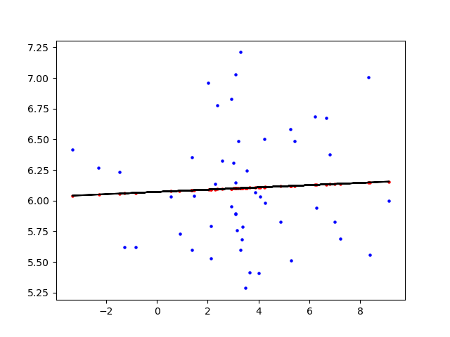
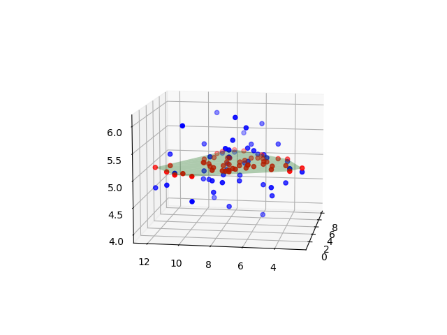
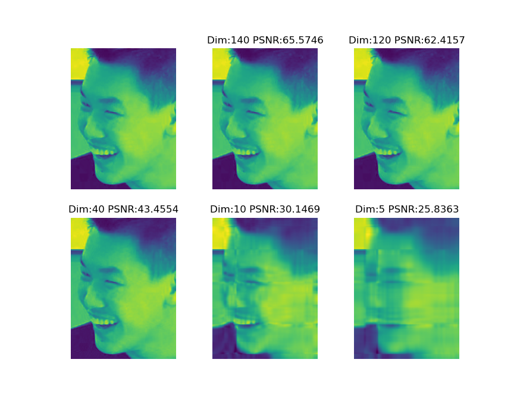

 
 
 
 
 
 

<h3>哈尔滨工业大学计算机科学与技术学院</h3>

<h2>实验报告</h2>

 
 
 
 
 
 

<h4>课程名称：机器学习</h4>

<h4>课程类型：选修</h4>

<h4>实验题目：PCA模型实验</h4>

 
 
 

学号：7203610316

姓名：符兴

## 1.实验目的

&emsp;&emsp;实现一个PCA模型，能够对给定数据进行降维（即找到其中的主成分）。

## 2.实验要求及实验环境

### 2-1.实验要求

&emsp;&emsp;1.首先人工生成一些数据（如三维数据），让它们主要分布在低维空间中，如首先让某个维度的方差远小于其它维度，然后对这些数据旋转。生成这些数据后，用你的PCA方法进行主成分提取。
&emsp;&emsp;2.找一个人脸数据（小点样本量），用你实现PCA方法对该数据降维，找出一些主成分，然后用这些主成分对每一副人脸图像进行重建，比较一些它们与原图像有多大差别（用信噪比衡量）。

### 2-2.实验环境

&emsp;&emsp;Ubuntu+VSCode+Python3.9

## 3.设计思想（本程序中的用到的主要算法及数据结构）

### 3-1.生成训练数据
&emsp;&emsp;在本次实验中，使用`np.random.multivariate_normal()`生成高斯分布。
&emsp;&emsp;设定二维高斯分布的均值和方差分别为：$\mu = [3,6] $,$ \sigma = [[5,0],[0,0.2]]$
&emsp;&emsp;设定三维高斯分布的均值和方差分别为：$\mu = [3,7,5] $,$ \sigma = [[5,0,0],[0,5,0],[0,0,0.2]] $

### 3-2.PCA
PCA(主成分分析，Principal Component Analysis)是最常用的一种降维方法。PCA的主要思想是将D维特征通过一组投影向量映射到K维上，这K维是全新的正交特征，称之为主成分，采用主成分作为数据的代表，有效地降低了数据维度，且保留了最多的信息。关于PCA的推导有两种方式：

- 最大投影误差：样本点在这个超平面上的投影尽可能地分开。
- 最小投影距离：样本点到这个超平面地距离都足够近。

### 3-2-1.中心化

假设数据集$X=\{x_1,…,x_n\}$，其中$x_i=\{x_{i1},…,x_{id}\}$，即$X$是一个$n \times d$的矩阵，则此数据集的中心向量为

$$
\mu = \frac{1}{n}\sum^n_{i=1}x_i
$$

对数据集的每个样本均进行操作：

$$
x_i=x_i-\mu
$$

就得到了中心化后的数据，此时有:

$$
\sum^n_{i=1}x_i=0
$$

中心化可以给后面的计算带来极大的便利，因为中心化之后的常规线性变换就是绕原点的旋转变化。此时，协方差：

$$
S=\frac{1}{n}\sum^n_{i=1}x_ix_i^T
$$

设使用的投影坐标系的一组标准正交基为$U_{k\times d} =\{u_1,…,u_k\}$，$k < d$，$u_i=\{u_{i1},…,u_{id}\}$，故有$UU^T = 1$。使用这组基变换中心化矩阵$X$，得降维压缩后的矩阵

$$
Y_{n\times k} = XU^T
$$

### 3-2-2.最大投影方差

对任意一个样本$x_i$，在新的坐标系中的投影为$y_i = x_iU^T$，在新坐标系中的投影方差为$y_i^Ty_i = Ux_i^Tx_iU^T$。要使得所有的样本的投影方差和最大，也就是求:

$$
\argmax_U \sum^n_{i=1}Ux_i^Tx_iU^T
$$

$$
\text{s.t. } UU^T = 1
$$

在$u_1$方向投影后的方差：

$$
\frac{1}{n}(u_1X^TXu_i) = \frac{1}{n}u_1Su_1^T
$$

用拉格朗日乘子法最大化目标函数：

$$
L(u_1) = u_1^TSu_1 +\lambda_1(1-u_1^Tu_1)
$$

该目标函数对$u_1$求导，令导数为0，可得$Su_1=\lambda_1u_1$，即$\lambda_1 = u_1^TSu_1$，则求最大化方差等价于求最大的特征值。要将d维度的数据降到k维度，只需要计算前k个最大的特征值，作为特征向量，这就是主成分分析的解。

## 4.实验结果分析

<table style="width=200px;">
<caption align="top">表1 实验数据</caption>
<tr style="width=100px;">
<td>

图1 二维高斯分布的主成分分析

</td>
</tr>
<tr style="width=100px;">
<td>

图2 三维高斯分布的主成分分析

</td>
</tr>
<tr style="width=100px;">
<td>

图3 人脸数据的主成分分析

</td>
</tr>
</table>

&emsp;&emsp;在二维高斯分布的主成分分析中，由于第二维的方差远小于第一维，因此从理论上第二维应该包含了更多的信息；在对其进行PCA后，得到的实验结果直线更接近于与横轴平行，验证了我们的猜想。同样的，三维高斯分布的PCA结果也具有同样的效果。

&emsp;&emsp;分析人脸数据的PCA结果发现，当K=40时图像依旧保留了大部分信息；当K=5时，人脸数据已有较大的损失，但仍可以识别出人脸的大致轮廓。同时，分析信噪比数据发现，当保留的维度越高，图像保留的信息越多，信噪比也越大。

## 5.结论
&emsp;&emsp;1.PCA可以有效提取信息，尤其是对图像进行处理的时候，在保留信息的情况下降低维度，可以大大提高计算的效率，也能节省更多的存储空间。

&emsp;&emsp;2.PCA在降维时会舍弃某些信息，可能会导致模型的过拟合。

&emsp;&emsp;3.PCA提高了样本的采样密度，并且由于较小特征值对应的特征向量往往容易受到噪声的影响，在某种程度上起到了降噪的效果。

## 6.参考文献
&emsp;&emsp;[1]周志华. 机器学习
